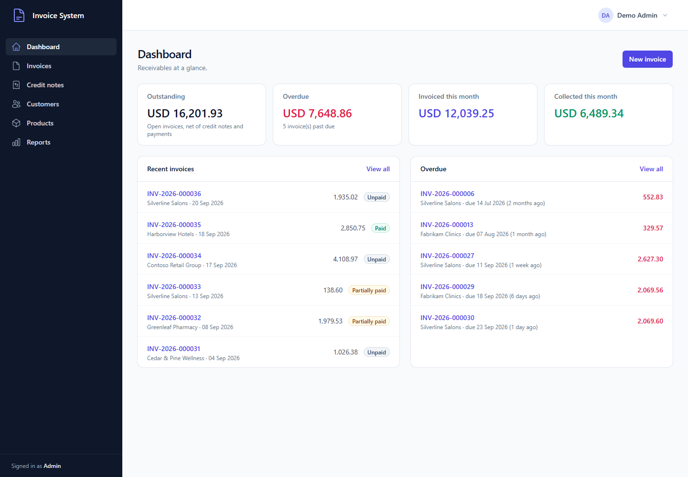
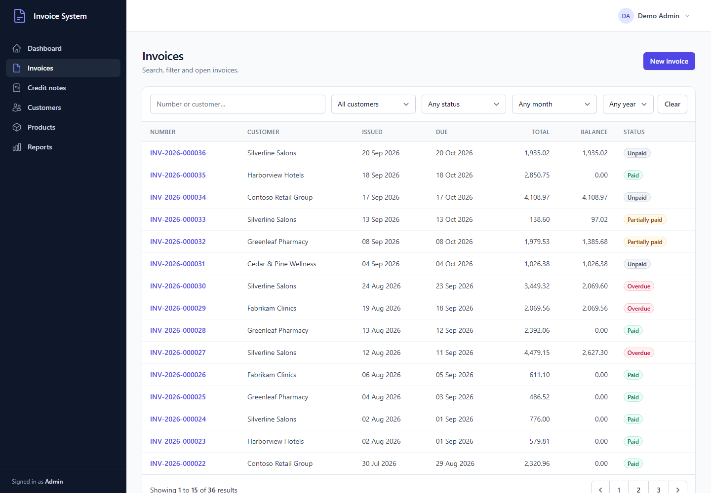
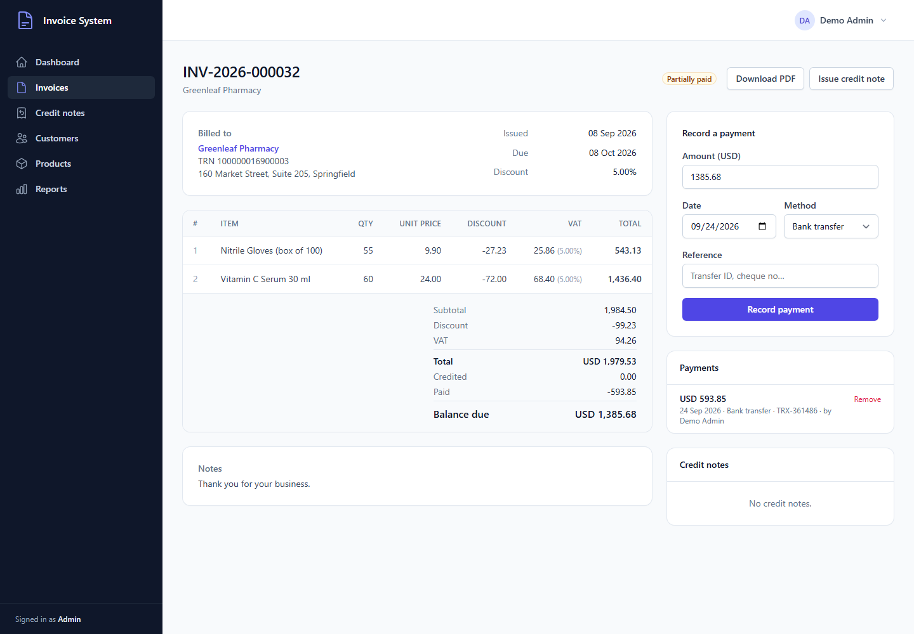
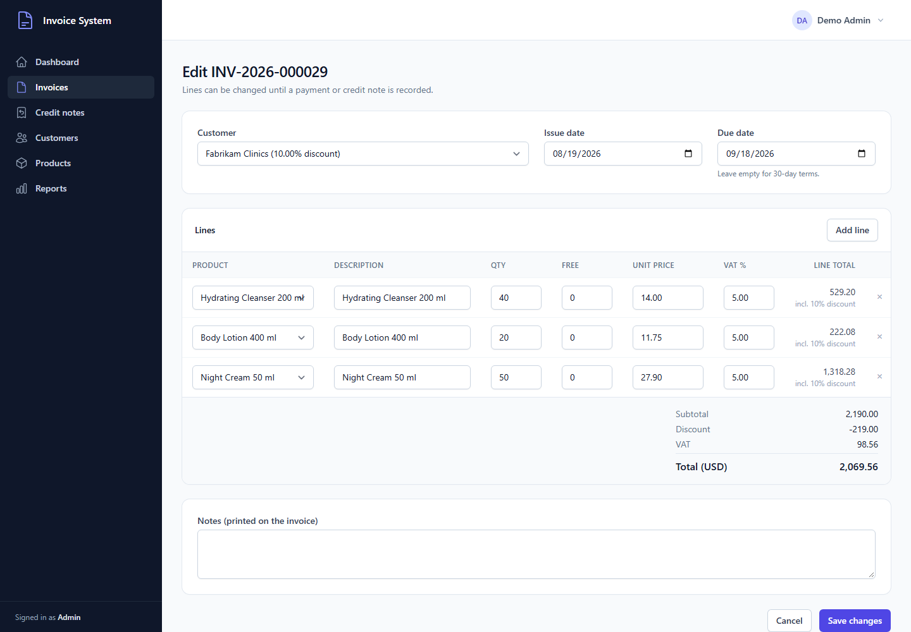
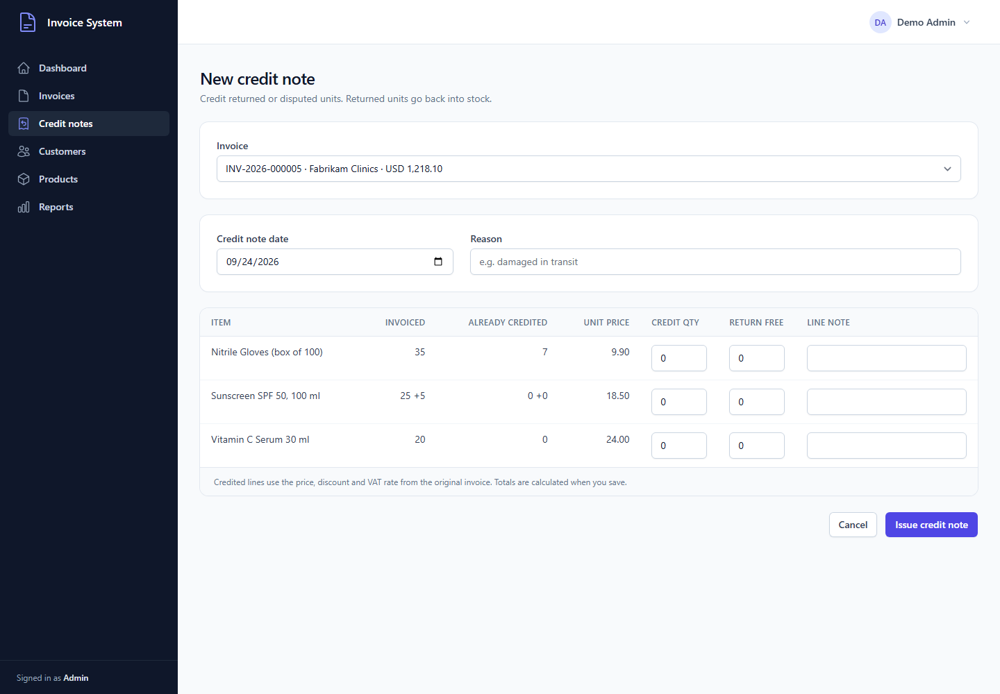
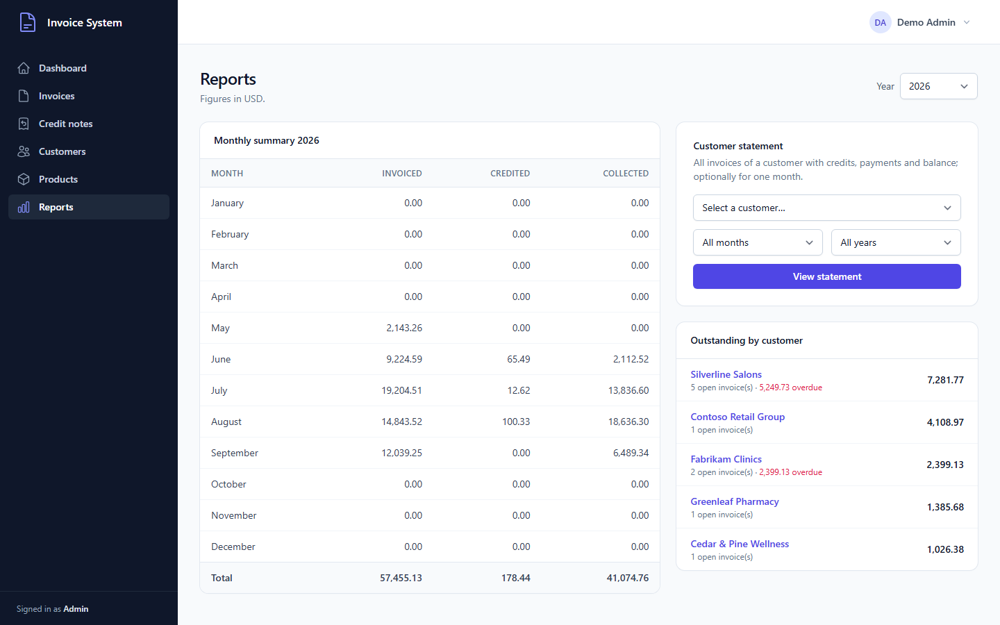

# Invoice System

[](https://github.com/mohammedname2002/invoice-system/actions/workflows/ci.yml)

An invoicing back office built with Laravel 12. It covers customers, a product catalogue with stock, invoices with line items, credit notes, payment tracking, PDF documents and receivables reports.

I first built it for a wholesale distributor, and that is where some of the domain rules come from: per-customer trade discounts, free bonus units on a line, and returns that go back into stock. This public version contains only fictional demo data.



## Features

**Customers**
- Contact details, tax registration number (TRN) and a trade discount rate per customer.
- A customer page shows the outstanding balance, the number of open invoices and the full invoice history.
- A customer who has invoices cannot be deleted.

**Products**
- Catalogue with unit price, VAT rate and SKU. A product can opt out of the customer discount (for example, promotional gift sets).
- Stock levels change only through invoices (stock out) and credit notes (stock back in). Each change is logged as an inventory movement.

**Invoices**
- Line editor with catalogue lines and free-text lines (delivery, services), and free bonus units per line. Totals update live in the browser; the server recalculates them on save.
- Invoice numbers are sequential per year (`INV-2025-000042`) and generated safely under concurrent requests.
- The due date comes from configurable payment terms when left empty.
- An invoice can be edited or deleted until money is applied to it. After a payment or credit note exists, corrections go through a credit note.
- PDF download.

**Credit notes**
- Credit paid units, return free units, or both, against specific invoice lines. You cannot credit more units than are still available on a line, even across several credit notes.
- Each credited line keeps the price, discount and VAT rate it was invoiced at. Returned units go back into stock.
- PDF download. Deleting a credit note reverses the stock movement and restores the invoice balance.

**Payments and status**
- Record full or partial payments with a method (bank transfer, cash, card, cheque) and a reference. A payment larger than the outstanding balance is rejected.
- The invoice status is always derived from the money position, never set by hand: `unpaid`, `partially paid`, `paid` or `overdue`. A scheduled command (`invoices:flag-overdue`) runs daily and moves invoices past their due date to overdue.

**Reports**
- Dashboard: outstanding, overdue, invoiced this month and collected this month.
- Monthly summary of invoiced, credited and collected amounts for a year.
- Outstanding balance by customer, with the overdue part shown separately.
- Customer statement for a customer and an optional month or year, as HTML and PDF.

**Access control**
- Three roles: **admin** (everything), **accountant** (create and edit, record payments, see reports; cannot delete) and **viewer** (read only).
- Public sign-up is disabled because this is an internal tool.

## Screenshots

| Invoices | Invoice |
| --- | --- |
|  |  |
| **Line editor** | **Credit note** |
|  |  |
| **Reports** | |
|  | |

## Architecture notes

The code is a conventional Laravel app. A few decisions matter more than the rest:

- **Money is an integer, not a float.** Amounts are stored as `BIGINT` minor units (cents). They are exposed as an immutable `App\Support\Money` value object through a custom Eloquent cast (`MoneyCast`). Percentages use integer arithmetic with half-up rounding to the cent, so the columns on a printed invoice always add up. `App\Support\LineTotals` holds the line formula in one place (subtotal, then discount, then VAT) and is covered by unit tests. The browser preview mirrors the same formula in cents.
- **Thin controllers, services for the business rules.** Controllers validate through FormRequests, call a service and redirect. `InvoiceService`, `CreditNoteService` and `PaymentService` own the rules. Each write that touches several tables (invoice header, lines, stock movements, totals) runs in a single database transaction.
- **Row locks where money is involved.** Recording a payment or a credit note first locks the invoice row (`SELECT ... FOR UPDATE`). This stops two simultaneous requests from overpaying an invoice or crediting the same units twice. Document numbers are generated inside the same transaction with a locking read, and a unique index is the final safety net.
- **Derived state is recalculated, not incremented.** `InvoiceService::refreshBalance()` sums payments and credit notes from their own rows and then derives the status with `InvoiceStatus::resolve()`. The cached `amount_paid` and `amount_credited` columns make lists fast, but they can never drift from the source rows.
- **History is immutable.** Invoice lines copy the description, unit price, discount rate and VAT rate at the time of issue, and the invoice keeps a snapshot of the customer discount. Changing a product price or a customer discount later does not rewrite old invoices. Credit notes reference the exact invoice line they reverse.
- **Enums for closed sets:** `InvoiceStatus`, `PaymentMethod`, `UserRole` and `InventoryMovementType`, all cast on the models.
- **Authorization on every route.** Each route declares a policy check with `->can(...)`. The rules live in a shared `RecordPolicy` (read, manage, delete), and `tests/Feature/RouteAuthorizationTest.php` fails the build if someone adds a route without a policy check. Livewire tables also authorize in `mount()`.
- **Strict Eloquent outside production.** `Model::shouldBeStrict()` turns lazy loading (N+1 queries), silently discarded attributes and missing attributes into exceptions during development and tests.
- **Livewire for list screens, Alpine for the line editor.** The four index tables (search and filters, synced to the URL) are Livewire components. The invoice line editor is a small Alpine component (`resources/js/invoice-editor.js`) that runs on the Alpine instance Livewire already ships.

```
app/
├── Casts/MoneyCast.php            # BIGINT minor units <-> Money
├── Console/Commands/              # invoices:flag-overdue (scheduled daily)
├── Enums/                         # InvoiceStatus, PaymentMethod, UserRole, InventoryMovementType
├── Http/Controllers/              # thin HTTP layer
├── Http/Requests/                 # validation
├── Livewire/                      # searchable, filterable index tables
├── Policies/                      # role-based rules (RecordPolicy + per-model policies)
├── Services/                      # invoices, credit notes, payments, inventory, reports, numbering
└── Support/                       # Money, LineTotals
```

## Getting started

Requirements: PHP 8.2+ (with `pdo_mysql`, `mbstring` and `dom`), Composer, Node.js 18+, and MySQL 8 or MariaDB 10.4+.

```bash
git clone https://github.com/mohammedname2002/invoice-system.git
cd invoice-system

composer install
cp .env.example .env
php artisan key:generate

# create an empty database called invoice_system (or change DB_* in .env), then:
php artisan migrate --seed

npm install
npm run build

php artisan serve
```

Open http://localhost:8000 and sign in with one of the demo accounts. All of them use the password `password`.

| Email | Role |
| --- | --- |
| `admin@example.com` | Admin |
| `accountant@example.com` | Accountant |
| `viewer@example.com` | Viewer (read only) |

The seeder creates 8 customers, 11 products and 36 invoices from the last four months, with payments, partial payments, a few credit notes and some overdue invoices. It uses the real services, so every total, status and stock level is exactly what the app itself would produce.

To flag overdue invoices automatically, run the Laravel scheduler (`php artisan schedule:work` locally, or a cron entry for `schedule:run` in production). You can also run it by hand with `php artisan invoices:flag-overdue`.

### Configuration

Your company details (printed on documents), the currency code, the default payment terms and the default VAT rate are set with the `INVOICE_*` variables in `.env` (see `config/invoicing.php`). The app works in one currency.

## Tests

The suite runs against MySQL or MariaDB, so the locking behaviour matches production:

```bash
mysql -uroot -e "CREATE DATABASE invoice_system_test"
vendor/bin/phpunit
```

Connection settings for the test database are in `phpunit.xml`. There are 88 tests:

- **Unit:** money parsing, arithmetic and rounding; line and document totals; status resolution.
- **Invoices:** exact totals with a discount, an opted-out product and a free-text line; stock movements; sequential numbering per year; default due dates; editing and the lock after payment; deletion; validation; Livewire filters; PDF.
- **Credit notes:** the balance goes down and stock comes back; the invoice is settled by a credit note alone or by a credit note plus a payment; units cannot be credited twice; validation; deleting a credit note reverses it; PDF.
- **Payments:** partially paid and paid; overpayment and invalid input are rejected; the overdue command on unpaid and partially paid invoices; removing a payment reopens the invoice.
- **Authorization:** guests, viewers, accountants and admins; the role cannot be escalated through the profile form; every route has a policy check.
- **Reports:** monthly summary, dashboard figures, outstanding by customer, statement filters and PDF.

Code style is checked with [Laravel Pint](https://laravel.com/docs/pint):

```bash
vendor/bin/pint --test
```

GitHub Actions runs Pint and the test suite on PHP 8.2 and 8.3 against a MySQL 8 service (`.github/workflows/ci.yml`).

## Tech stack

- Laravel 12, PHP 8.2+
- Livewire 3 and Alpine.js
- Tailwind CSS 3 (with `@tailwindcss/forms`), built with Vite
- MySQL / MariaDB
- barryvdh/laravel-dompdf for PDF documents
- PHPUnit 11 and Laravel Pint

## Limitations

- One currency per installation. There are no exchange rates or multi-currency invoices.
- Invoices are downloaded as PDF; the app does not email them.
- Users are created with the seeder or Tinker; there is no user-management screen yet.
